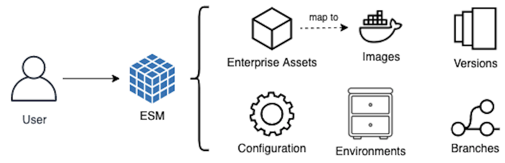

# Asset Development

Asset development is the first part of Codiac's [three-tier workflow](./index.md#codiac-in-three-tiers) for maintaining an enterprise in a containerized cluster.  It is defining an enterprise asset and publishing it to a container registry.

<!--
It is all the processes that culiminate in both defining an enterprise asset, and getting its image published to a container registry.  
-->

## Asset Development Processes:

* **Declaring an Asset** in an enterprise
* **Source control**, branching, and merging
* Defining **configuration settings** for it
* Applying concrete **configuration values** for various environments
* Declaring and building its **docker image**
* **Publishing** new versions of its image to a container registry

&nbsp;

*NOTE: The moment you decide to **deploy** that asset, you've just crossed over into the [DevOps](./devops.md) tier*.

## CLI Commands for Asset Development

You will be using the following Codiac CLI during asset development 

  * init
  * build
  * dep
  * run
  * image
  * package
  * config
  * envar
  * Source Control
    *   branch
    *   stage
    *   commit
    *   push
    *   pull
    *   merge
    *   sync
  * publish

