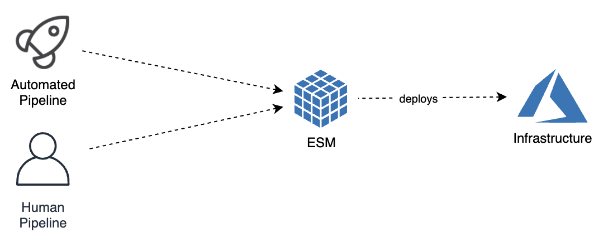

# Dev Ops / Pipelines

Codiac Acts as the interface for deploying your projects.
Because it remembers what you said earlier when you defined your assets and environments, and again when you published new versions of them, it doesnt need to ask you much about what to do.  

## Devops Commands:

  * [Pipeline]() 
  * [Deploy]()
  * [Rollback]()
  * [Adjust]()  <!-- env, config, footprint -->
  * [Reset]()  <!-- restarts pods -->
