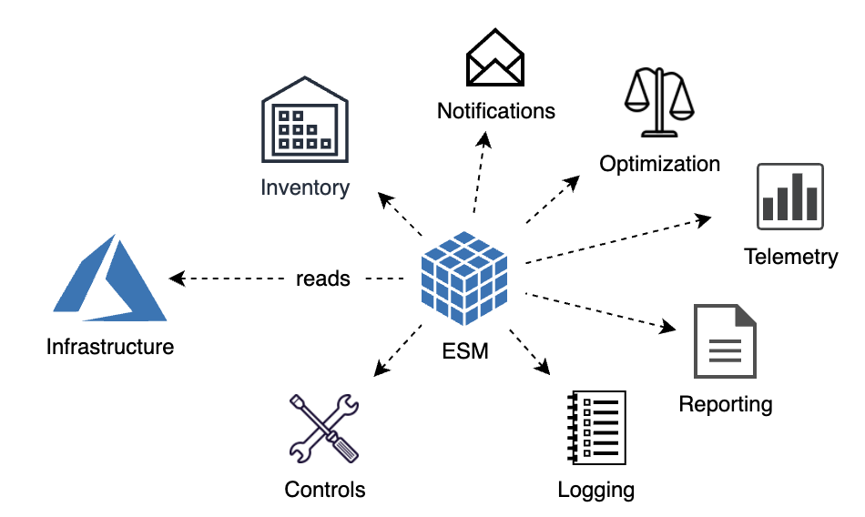

# Runtime Management / Kubernetes

## Runtime Management Commands:

  <!-- * [Enterprise](../cli/command-reference.md#enterprise) -->
  <!-- * [Environment](../cli/command-reference.md#environment) -->
  * [cabinet](../cli/command-reference.md#cabinet)
  * [asset](../cli/command-reference.md#asset)
  <!--  
  * [JobHandler]()   (future) (just an asset with ondemand finite execution) 
  * [Process/Job (JobHandler orchestration)]()
  * [  OnEvent]()
  * [  OnTimer]()
  * [JobHandler (just an asset with on-demand finite execution)]()
  * [Process/Job (JobHandler orchestration)]()
  -->
